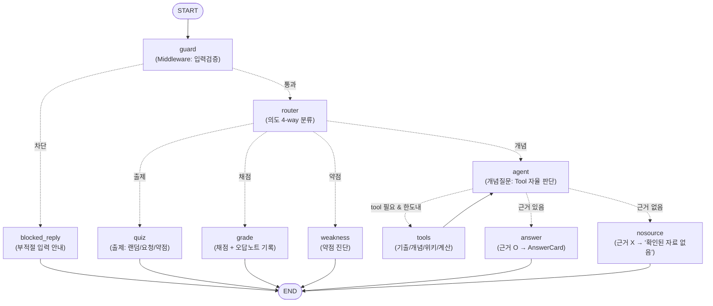

# 사관(史官) — 오답노트 기반 한국사능력검정 학습 Agent

> 틀린 문제를 기억해 약점을 짚어주고, 모든 답에 기출·사료 근거를 붙이는
> LangGraph 기반 한국사 학습 에이전트.

LangChain / LangGraph 핵심 개념(Message · PromptTemplate · OutputParser · Tool ·
RAG · Memory · Middleware · StateGraph)을 종합해 **실제로 동작하는 Agent 서비스**로 구현했다.

---

## 1. 서비스 소개 및 사용 시나리오

### 문제 정의
한능검 수험생의 진짜 병목은 "지식을 어디서 얻느냐"가 아니라 **한정된 시간을 어디에 쓰느냐**다. 기출문제집, 인강, ChatGPT까지 학습 자원은 이미 넘친다. 문제는 이것들 중 어느 것도 지금 내게 가장 급한 게 무엇인지를 계산해주지 않는다는 데 있다.

기출문제집은 내 약점을 모른 채 1번부터 순서대로 풀게 한다.
ChatGPT에 "문제 내줘" 하면 매번 새로 시작해 내가 뭘 틀렸는지 누적하지 못하고, 그 문제가 실제 시험 경향과 맞는지도 보장하지 못한다.
그 결과 수험생은 이미 아는 영역을 반복하거나, 잘 안 나오는 지엽적 내용에 시간을 낭비하기 쉽다.

### 차별점
이 서비스의 핵심은 내 약점(오답노트) × 문제 유형별 출제 비중을 교차 분석해, **지금 당장 공부할 우선순위**를 제시하는 것이다.

1. 오답노트 × 출제 비중 교차 분석
   > 틀린 문제의 시대·주제를 wrong_tags에 누적하고, 이를 문제 유형별 출제 비중과 곱해 우선순위를 매긴다. 약점이지만 잘 안 나오는 영역은 뒤로 미루고, **약점이면서 자주 나오는 영역**을 먼저 짚는다. ChatGPT도 기출집도 하지 않는, 시간 대비 점수 효율을 극대화하는 전략 제시
2. 출제 품질 보장
   > 지어낸 문제가 아닌 검증된 유형에서만 출제
ChatGPT가 즉석에서 만든 문제는 실제 시험 경향과 어긋날 수 있다. 이 서비스는 직접 구축·검수한 기출 유형 DB에서만 출제해, 실전과 동떨어진 문제로 공부하는 것을 막는다.
3. 실제 기출 통계 반영
   > 국사편찬위원회 공식 최근 22개 회차(57~78회) 기출 1,100문항을 직접 분석해 시대·주제 빈출도를 집계했고, 약점 진단 시 "이 영역은 최근 22회 중 약 N회 출제된 빈출 영역"이라는 **검증된 근거 수치**를 제시한다.

### 사용 시나리오 
```
사용자: 한국사 문제 하나 내줘
  사관 : [오답노트 확인 → 아직 없음 → 랜덤 출제]
         "Q. 다음 중 무단 통치기 일제의 정책으로 옳은 것은? ..." (근거: 📜 기출)
사용자: 1번
  사관 : "오답입니다. 정답은 4번. [해설] ..." → 오답노트에 '일제강점기·정치' 기록
사용자: 나 뭐가 약해?
  사관 : "일제강점기·정치에서 자주 틀렸어요. 이 영역은 최근 22회 중 약 65회 출제된
          빈출 영역이라 우선 보완이 필요해요."
사용자: 광복은 몇 년도야?
  사관 : "광복은 1945년 8월 15일입니다 ..." (근거: 📖 개념·사료)
```

---

## 2. 전체 아키텍처

> 노드별 책임·상태 설계·분기/반복·RAG 전처리 등 **상세 설계 문서는
> [docs/WORKFLOW.md](docs/WORKFLOW.md)** 를 참고

### Workflow 다이어그램
`app/graph.py` 의 `graph.get_graph().draw_mermaid()` 로 자동 생성되며, `GET /api/diagram` 으로
언제든 최신 그래프를 확인할 수 있다.



### 조건부 분기 / 반복 
- **조건부 분기 ①**: `guard → blocked_reply | router` (가드레일)
- **조건부 분기 ②**: `router → quiz | grade | weakness | agent` (의도 기반 4-way) — 핵심 분기
- **조건부 분기 ③**: `agent → tools | answer | nosource` (Tool 사용 + 근거 유무)
- **반복(loop)**: `agent → tools → agent` (`MAX_TOOL_ROUNDS=3` 으로 제한)

### 폴더 구조
```
FinalProject/
├── app/
│   ├── config.py       # 모델명·경로·임계값 등 전역 설정 일원화
│   ├── state.py        # AgentState(TypedDict) + 카드 4종(Pydantic)
│   ├── middleware.py   # InputGuardrail + tool_middleware(로깅/재시도)
│   ├── vectorstore.py  # 기출·개념 2개 FAISS 인덱스 구축/캐시
│   ├── tools.py        # @tool 4종 (벡터검색 2 + 위키 + 계산)
│   ├── learning.py     # 출제·채점·약점 진단 순수 로직 (그래프에서 분리)
│   ├── graph.py        # StateGraph 전체 흐름 (router 4-way, agent-tools 루프)
│   └── server.py       # FastAPI: / , /api/chat , /api/diagram
├── data/
│   ├── past_exams.jsonl    # 자체 제작 기출 120문항 (RAG 원천)
│   ├── history_notes.txt   # 개념·사료 요약 80건 (RAG 원천)
│   └── topic_stats.json    # 최근 22회 빈출 통계 (약점 진단 근거)
├── static/index.html   # 채팅 UI + 사이드바 + 오답노트 표시
├── requirements.txt
├── .env.example
└── .gitignore
```

---

## 3. 설치 및 실행 방법

```bash
# 1. 가상환경
python -m venv venv && source venv/bin/activate   # Windows: venv\Scripts\activate

# 2. 의존성 설치
pip install -r requirements.txt

# 3. API 키 설정 (하드코딩 금지 — .env 분리 관리)
cp .env.example .env
# .env 파일을 열어 OPENAI_API_KEY 입력

# 4. 서버 실행
uvicorn app.server:app --reload

# 5. 브라우저 접속 → http://127.0.0.1:8000
```
> 최초 실행 시 기출 120문항·개념 80건을 임베딩해 `data/faiss_exams/`, `data/faiss_notes/`에
> 캐시한다(이후 재사용)

---

## 4. 구성 요소 상세 

| 평가 요건 | 구현 |
|---|---|
| Tool 2개+ (자율 선택) | `agent` 노드에 4개 Tool 바인딩 → LLM이 질문 유형에 따라 자율 분기 |
| RAG 1개+ | 기출·개념 **두 개의 FAISS 벡터 파이프라인** |
| 메모리(멀티턴) | `SqliteSaver` + `thread_id`. **오답노트(`wrong_tags`)를 State에 누적·파일 DB에 영속화** |
| LangGraph 분기 | 조건부 분기 3종 + 반복 루프 1종 (위 다이어그램) |
| Middleware | 입력 가드레일 + Tool 로깅/재시도 데코레이터 |
| OutputParser(구조화) | `QuizCard`/`GradeCard`/`WeaknessReport`/`AnswerCard` (Pydantic) |

### Tool (4개)
| Tool | 유형 | 역할 |
|---|---|---|
| `search_past_exams` | 벡터DB 검색(RAG) | 기출 문제 유사도 검색 |
| `search_history_source` | 벡터DB 검색(RAG) | 개념·사료 유사도 검색 (개념 질문 1순위) |
| `search_wikipedia` | 외부 검색 | 개념 DB에 없는 지엽적 용어 보완 |
| `calculate_year_gap` | 로직 계산 | 두 사건의 연도 차이 계산 |

`@tool` 데코레이터의 docstring이 곧 LLM의 선택 근거, "탕평책이 뭐야?"는 `search_history_source`,
"환곡제가 뭐야?"(노트에 없으면) `search_wikipedia`, "임진왜란과 병자호란 몇 년 차이?"는
`calculate_year_gap` 으로 — LLM이 서로 다른 Tool로 자율 분기

### RAG 파이프라인
`data/*` → **전처리**(JSON/텍스트 파싱, 제목·메타데이터 분리) → `text-embedding-3-small` 임베딩
→ FAISS 인덱싱(로컬 캐시) → 유사도 검색(k=3) + 거리 임계값 필터 → 근거로 주입
출제·채점은 실제 기출 DB에서만 근거를 가져와 오해를 차단

### Memory
- **서버**: `SqliteSaver` 체크포인터 + `thread_id`(대화·오답노트를 `data/checkpoints.sqlite`에 영속화). `add_messages` 리듀서로 대화 이력이 누적되고,
  **`wrong_tags`·`last_quiz` 가 thread별로 유지**되어 오답노트·채점이 성립
- **클라이언트**: 좌측 사이드바에 대화 목록을 `localStorage`로 저장. 각 대화가 고유 `thread_id`를
  가져 새로고침 후에도 이전 대화 조회 가능
- 과거 턴의 `tool_call↔ToolMessage` 쌍이 누적되어 발생하는 OpenAI 400 에러는 "과거 턴은 완결된
  대화만, 현재 턴은 tool 메시지 포함 전체" 로 메시지를 정리해 예방

### Middleware
| Middleware | 대응 훅 | 기능 |
|---|---|---|
| `InputGuardrail` | before_model | 빈 입력/300자 초과/위험 패턴(개인정보·불법·자해) 차단 |
| `tool_middleware` | wrap_tool_call | 모든 Tool 호출 로깅(소요시간)·예외 캐치·백오프 재시도·fallback 반환 |

### OutputParser
개념 답변은 `with_structured_output(AnswerCard)`로 Pydantic 스키마를 강제한다. `source`/`is_verified`는
LLM 자기보고가 아니라 **실제 ToolMessage 실행 기록**으로 코드에서 재계산해 신뢰성을 확보

### Chain / Runnable 조합 
`router`(의도 분류)와 `answer`(개념 답변)는 `ChatPromptTemplate | ChatOpenAI.with_structured_output(...)`
형태의 **LCEL 체인**으로 구성했다(`app/graph.py`의 `_router_chain`, `_answer_chain`). 프롬프트·모델·
OutputParser를 Runnable 파이프로 조합해 재사용성과 가독성을 높였다.

---

## 5. 데이터 구축 방법 - 직접 제작

- **`past_exams.jsonl` (120문항)** — 국사편찬위원회 공식 최근 22개 회차(57-78회, 2022-2026) 기출
  1,100문항을 직접 내려받아 문항별 시대·주제를 태깅·집계한 뒤, 그 **빈출 분포에 비례**해 실존
  사실(연도·인물·사건)에 정확히 기반한 문항을 자체 제작, `source`는 실제 회차를 사칭하지 않고
  "한능검 기출 유형 · 자체 제작"으로 표기
- **`history_notes.txt` (80건)** — 시대별 핵심 개념·사료 요약을 "제목 ::: 본문" 형식으로 직접 작성
- **`topic_stats.json`** — 22회차 태깅 결과의 (시대·주제)별 출제 횟수·회차 통계

---

## 6. 기술 스택
- Python 3.11 / LangChain 1.x / LangGraph 1.x (최신)
- OpenAI `gpt-4o-mini`(판단·답변) + `text-embedding-3-small`(임베딩)
- FAISS(로컬 벡터스토어), Wikipedia API(langchain-community)
- FastAPI + Uvicorn, Vanilla JS 프론트엔드

---

## 7. 한계점 및 향후 개선 방향
**한계점**
- 오답노트를 `SqliteSaver`로 파일 DB에 영속화해 서버 재시작 후에도 유지된다(로그인 기반 사용자별 분리는 미구현)
- 출제 문항이 120개라 같은 문제가 반복될 수 있다

**향후 개선**
- 로그인 기반 사용자별 오답노트 분리 저장
- 문항 확충 및 유사 문항 중복 방지 로직 강화

---

## 8. 오픈소스 출처 및 저작권 

| 라이브러리 | 용도 | 라이선스 |
|---|---|---|
| [LangChain](https://github.com/langchain-ai/langchain) | `@tool`·메시지·구조화 출력 | MIT |
| [LangGraph](https://github.com/langchain-ai/langgraph) | StateGraph·ToolNode | MIT |
| [langgraph-checkpoint-sqlite](https://github.com/langchain-ai/langgraph) | SqliteSaver(대화·오답노트 영속화) | MIT |
| [langchain-openai](https://github.com/langchain-ai/langchain) | ChatModel·임베딩 연동 | MIT |
| [langchain-community](https://github.com/langchain-ai/langchain) | WikipediaQueryRun | MIT |
| [wikipedia](https://github.com/goldsmith/Wikipedia) | 위키백과 API 파이썬 래퍼 | MIT |
| [FAISS](https://github.com/facebookresearch/faiss) (faiss-cpu) | 로컬 벡터 유사도 검색 | MIT |
| [FastAPI](https://github.com/fastapi/fastapi) | 웹 서버 | MIT |
| [Uvicorn](https://github.com/encode/uvicorn) | ASGI 서버 | BSD-3-Clause |
| [Pydantic](https://github.com/pydantic/pydantic) | 데이터 검증·구조화 출력 | MIT |
| [python-dotenv](https://github.com/theskumar/python-dotenv) | `.env` 로드 | BSD-3-Clause |

### 참고한 공식 문서 패턴
아래는 라이브러리의 표준 사용법(정해진 API)을 공식 문서에서 참고한 부분
- LangGraph 공식 문서 — `StateGraph` 조립, `add_conditional_edges`, `ToolNode` 기반 ReAct 루프,
  `SqliteSaver` 체크포인터, `get_graph().draw_mermaid()` 다이어그램 생성
- LangChain 공식 문서 — `@tool` 데코레이터, `with_structured_output()`, LCEL 체인(`prompt | model`),
  `WikipediaQueryRun` 연동

### 데이터 출처
- 기출 원천: [국사편찬위원회 한국사능력검정시험 자료실](https://www.historyexam.go.kr/pst/list.do?bbs=dat)
  공식 공개 기출(최근 22개 회차)을 분석·집계에 활용. 배포 문항은 이를 사칭하지 않은 자체 제작물
- 시대별 비중·빈출 경향 참고: 국사편찬위원회 공개 기출 및 일반 한국사 지식을 바탕으로 직접 정리

### 외부 폰트
- [Gowun Batang](https://fonts.google.com/specimen/Gowun+Batang),
  [IBM Plex Sans KR](https://fonts.google.com/specimen/IBM+Plex+Sans+KR) — Google Fonts (OFL)
