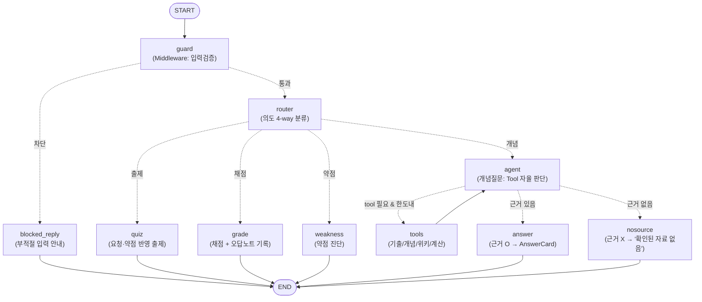

# Workflow & 설계 문서 (사관 史官)

코드에서 분리한 **아키텍처·흐름·설계 근거**를 모은 문서입니다. 각 소스 파일의 상세 설명은
여기서 확인하세요. (요약·설치·사용법은 [README.md](../README.md) 참조)

---

## 1. Workflow 다이어그램

`app/graph.py` 의 `graph.get_graph().draw_mermaid()` 로 자동 생성되며,
`GET /api/diagram` 으로 실시간 확인할 수 있습니다.



### ASCII 흐름 (요약)
```
START → guard ─(차단)─→ blocked_reply → END
         │(통과)
         ▼
       router ──(의도 4-way 조건부 분기)──┐
         ├─ 출제  → quiz     → END        │
         ├─ 채점  → grade    → END        │
         ├─ 약점  → weakness → END        │
         └─ 개념  → agent ◄──────┐        │   agent: ReAct — Tool 자율 선택
                     │           │        │
            (tool_calls 있음 &   │        │
             반복 한도 미만)      │        │
                     ▼           │        │
                   tools ────────┘        │   실행 후 agent 로 복귀(반복 루프)
                     │
              (답변 단계)
               ├─ 근거 있음 → answer   → END
               └─ 근거 없음 → nosource → END
```

---

## 2. 노드 책임 (app/graph.py)

| 노드 | 종류 | 책임 |
|---|---|---|
| `guard` | Middleware | `InputGuardrail.validate()` 로 입력 검증 → `blocked` 세팅 |
| `blocked_reply` | 종단 | 차단 사유 안내(LLM 호출 없음) |
| `router` | LLM 분류 | 의도를 quiz/grade/weakness/concept 로 분류(구조화 출력 `Intent`) |
| `quiz` | 결정론 | `learning.select_quiz()` 로 기출 선택, `last_quiz` 저장 |
| `grade` | 결정론 | `learning.grade_answer()` 로 채점, 오답 시 `wrong_tags` 누적 |
| `weakness` | 결정론 | `learning.build_weakness_report()` 로 오답노트 집계+빈출 통계 |
| `agent` | ReAct | 개념 질문에 대해 Tool 호출 여부·종류를 LLM 이 자율 결정 |
| `tools` | 실행 | `ToolNode` 로 Tool 실행 + 반복 카운트 증가 |
| `answer` | 구조화 출력 | 수집 근거로 `AnswerCard` 생성(`with_structured_output`) |
| `nosource` | 종단 | 근거가 없을 때 '확인된 자료 없음'으로 정직하게 응답 |

---

## 3. 조건부 분기 · 반복 (평가 요건 매핑)

- **조건부 분기 ①** `guard → blocked_reply | router` — 가드레일
- **조건부 분기 ②** `router → quiz | grade | weakness | agent` — 의도 기반 4-way(핵심 분기)
- **조건부 분기 ③** `agent → tools | answer | nosource` — Tool 사용 + 근거 유무
- **반복(loop)** `agent → tools → agent` — `MAX_TOOL_ROUNDS`(=3) 로 제한해 무한루프 방지

`route_after_agent` 는 (a) LLM 이 Tool 을 더 쓰려 하고 한도 미만이면 `tools`,
(b) 아니면 실제 수집된 근거 유무로 `answer`/`nosource` 를 가른다.

---

## 4. 상태 설계 (app/state.py — AgentState)

State 는 그래프의 '공유 노트'다. 메모리 필드와 턴 작업 필드를 분리 설계했다.

| 필드 | 성격 | 설명 |
|---|---|---|
| `messages` | 메모리(리듀서) | `add_messages` 로 누적 → 멀티턴 대화 이력 |
| `wrong_tags` | 메모리 | `{"조선후기·경제": 3, ...}` 오답노트. **약점 진단의 근거(차별점)** |
| `last_quiz` | 메모리 | 직전 출제 문제. 채점 시 정답 대조용 |
| `question`, `intent` | 턴 입력/분류 | 이번 질문과 router 분류 결과 |
| `context`, `source`, `iterations` | 턴 작업 | 개념질문의 근거·출처·반복 횟수 |
| `blocked`, `blocked_reason` | 가드레일 | 차단 여부·사유 |
| `card`, `card_type` | 출력 | 최종 구조화 카드와 종류 |

**핵심**: `wrong_tags`·`last_quiz` 는 `SqliteSaver` + `thread_id` 로 thread(대화)별
유지되어야 오답노트·채점이 성립한다. 그래서 `server._new_turn_state()` 는 이 필드들을
입력에 넣지 않아 checkpointer 의 이전 값이 보존되게 한다.

---

## 5. 구조화 출력 (OutputParser 요건, app/state.py)

LLM 자유 텍스트 대신 Pydantic 스키마 객체를 강제로 받아 프론트가 카드로 렌더링한다.

- `QuizCard` (출제) · `GradeCard` (채점) · `WeaknessReport` (약점) — 결정론 로직이 직접 생성
- `AnswerCard` (개념 답변) — `answer_node` 에서 `with_structured_output(AnswerCard)` 로 생성
- `Intent` — router 분류 결과의 구조화 파싱

`AnswerCard.source`/`is_verified` 는 LLM 자기보고가 아니라 **실제 ToolMessage 실행 기록**으로
`_collect_turn_evidence()` 에서 코드가 확정한다(신뢰성 확보).

**LCEL 체인(Chain/Runnable 조합)**: `router`·`answer` 는
`ChatPromptTemplate | ChatOpenAI.with_structured_output(...)` 형태의 LCEL 체인(`_router_chain`,
`_answer_chain`)으로 구성해 프롬프트·모델·파서를 Runnable 파이프로 조합했다. `agent` 는 동적
메시지 이력을 다루므로 `bind_tools` 모델을 직접 invoke 한다.

---

## 6. Tool 설계 (app/tools.py)

성격이 다른 4개 Tool 을 `agent` 에 바인딩해, LLM 이 질문 유형에 따라 다른 Tool 로 분기한다.

| Tool | 유형 | 사용 시점 |
|---|---|---|
| `search_history_source` | 벡터DB(RAG) | 개념·사건·연도·인물 질문 1순위 |
| `search_past_exams` | 벡터DB(RAG) | 기출 예시 요청 / 개념에 출제 사례 보강 |
| `search_wikipedia` | 외부 검색 | 개념 DB에 없는 지엽적 용어 보완(NO_RESULT 폴백) |
| `calculate_year_gap` | 로직 계산 | 두 사건의 연도 차이 |

`@tool` 데코레이터가 함수명→이름, docstring→설명, 타입힌트→입력 스키마로 변환한다.
docstring 이 곧 LLM 의 선택 근거이므로 '언제 쓸지'를 명확히 기술했다. 검색 Tool 은
`tool_middleware` 로 감싸 로깅·예외처리·재시도가 자동 적용된다.

---

## 7. RAG 파이프라인 (app/vectorstore.py)

전처리 → 임베딩 → 인덱싱을 두 원천에 각각 수행하고 로컬(`data/faiss_*`)에 캐시한다.

- **기출(`past_exams.jsonl`)**: 한 줄=문항 1개. 지문+선택지+해설을 한 덩어리로 임베딩(질의 매칭↑),
  정답/시대/주제/출처는 `metadata` 로 분리해 출제·채점 노드가 구조화된 형태로 활용.
- **개념(`history_notes.txt`)**: `제목 ::: 본문`. 제목을 메타데이터로 분리하고 제목+본문을 함께 임베딩.
- 검색은 유사도 top-k + 개념 DB는 거리 임계값(`NOTES_SCORE_THRESHOLD`) 필터로 관련성 보장.

**출제의 환각 방지**: `quiz_node` 는 새 문제를 LLM 으로 생성하지 않고 **실제 기출 DB에서
검색해 선택**한다. 정확한 문항·정답·해설이 보장되고, 요청/약점 태그에 따라 대상 시대·주제를
좁혀 집중 출제한다.

---

## 8. 메모리 & 대화 맥락 (멀티턴)

- **서버**: `SqliteSaver` + `thread_id` 로 대화 이력·오답노트를 파일 DB(`data/checkpoints.sqlite`)에 영속화 → 서버를 껐다 켜도 유지.
- **클라이언트**: 좌측 사이드바에 대화 목록을 `localStorage` 로 저장(각 대화가 고유 `thread_id`).
- **agent 메시지 정리**: `_messages_for_agent()` 는 과거 턴은 완결된 사람↔AI 메시지만,
  현재 턴은 tool 메시지 포함 전체를 넘긴다. 과거 턴의 `tool_call↔ToolMessage` 쌍이 누적
  재전송되면 OpenAI 가 400 에러를 내기 때문이다.
- **채점 안정성**: 답안 제출 시 클라이언트가 '풀고 있는 문제'(QuizCard)를 함께 보내
  `server` 가 `last_quiz` 로 주입한다(SqliteSaver 영속화와 별개의 이중 안전장치).

---

## 9. Middleware (app/middleware.py)

커스텀 StateGraph 이므로 LangChain AgentMiddleware 의 훅 개념을 같은 역할로 구현했다.

- `InputGuardrail` (before_model): 빈 입력/과길이/위험 패턴(개인정보·불법·자해) 차단 — `guard` 노드에서 실행
- `tool_middleware` (wrap_tool_call): Tool 호출 로깅(소요시간)·예외 캐치·백오프 재시도·fallback 반환.
  Tool 안정성을 데코레이터로 분리해 각 Tool 본문은 검색 로직에만 집중한다.
